# Praktikum Modul 5 Jarkom

Brush Stroke

Brush Stroke

Brush Stroke

Brush Stroke

Brush Stroke

Brush Stroke

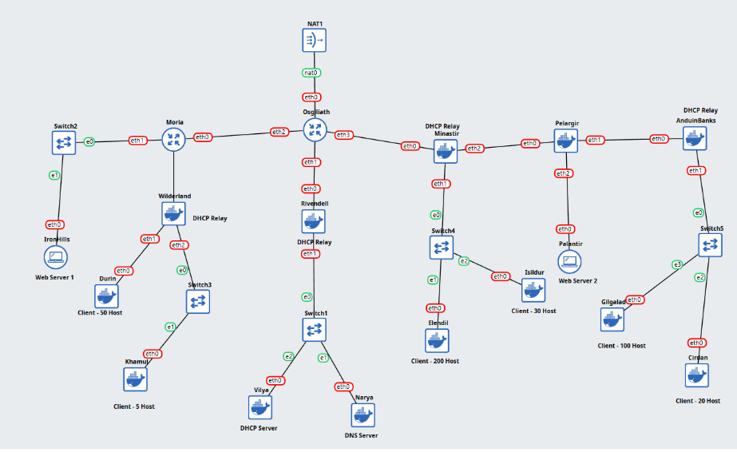

\# Jarkom-Modul-5-K56


\# LAPORAN PRAKTIKUM MODUL-5


\## Praktikum Komunikasi data & Jaringan Komputer kelompook K56


\| Nama | NRP |

\| ----------------------- | ---------- |

\| Mochammad Atha Tajuddin | 5027241093 |

\| Muhammad Huda Rabbani | 5027241098 |


\---


!\[Gambar,struktur subnet tree]\(\<u>images/Subnetting-Tree\_Modul5\_Jarkom.png\</u>)


***

# Konfigurasi & Scripting


### Osgiliath

```
auto lo
iface lo inet loopback

# --- INTERNET (eth0) ---
# Sebaiknya dijadikan STATIC jika ingin pakai SNAT (Syarat Misi 2)
# Tapi untuk testing ping dulu, DHCP boleh.
auto eth0
iface eth0 inet dhcp

# --- KE MORIA (eth1) ---
auto eth1
iface eth1 inet static
    address 192.239.1.217
    netmask 255.255.255.252

# --- KE RIVENDELL (eth2) ---
auto eth2
iface eth2 inet static
    address 192.239.1.221
    netmask 255.255.255.252

# --- KE MINASTIR (eth3) ---
auto eth3
iface eth3 inet static
    address 192.239.1.225
    netmask 255.255.255.252

# 1. Routing Balik ke Client (AGAR PING BISA REPLY)
# Arah Kiri (Wilderland, Durin, Khamul, IronHills) -> Lempar ke Moria (.218)
# Kita rangkum subnet kiri (192.239.1.128 - .215)
up ip route add 192.239.1.128/25 via 192.239.1.218

# Arah Kanan (Minastir Client, Anduin, Palantir) -> Lempar ke Minastir (.226)
# Kita rangkum subnet kanan
up ip route add 192.239.0.0/24 via 192.239.1.226
up ip route add 192.239.1.0/25 via 192.239.1.226
up ip route add 192.239.1.200/29 via 192.239.1.226

# Arah Bawah (Server Vilya/Narya) -> Lempar ke Rivendell (.222)
up ip route add 192.239.1.192/29 via 192.239.1.222

# 2. NAT (Pilih Satu Saja)
# up iptables -t nat -A POSTROUTING -o eth0 -j MASQUERADE

# Ganti 192.168.122.x dengan IP yang didapat Osgiliath dari DHCP saat ini
up iptables -t nat -A POSTROUTING -o eth0 -j SNAT --to-source 192.168.122.115 -> ini beda karena ini dhcp


# 1. Rute ke Link Minastir-Pelargir (Tempat tinggal Pelargir)
# "Kalau mau ke subnet .232 (Pelargir), lewat Minastir (.226)"
ip route add 192.239.1.232/30 via 192.239.1.226

# 2. Rute ke Link Pelargir-Anduin (Tempat tinggal Anduin)
# "Kalau mau ke subnet .236 (Anduin), lewat Minastir (.226)"
ip route add 192.239.1.236/30 via 192.239.1.226

# "Paket buat Palantir (200), lempar ke Minastir (226)"
ip route add 192.239.1.200/29 via 192.239.1.226

# Pastikan Osgiliath tahu LAN Anduin ada di arah Minastir
ip route add 192.239.1.0/25 via 192.239.1.226

```

Untuk konfigurasi router pada Osgiliath menggunakan prefix 192.168.x.x karena sifatnya mengikuti nameserver atau IP asli GNS3 nya alias KVM nya karena kegunaanya untuk ping ke daerah luar seperti 1.1.1.1,google.com, dll. 


***

### Moria

```
# Konfigurasi Router MORIA

auto lo
iface lo inet loopback

# --- ARAH ATAS (UPLINK) ---
# Menuju Osgiliath
# Network: 192.239.1.216/30
auto eth0
iface eth0 inet static
    address 192.239.1.218
    netmask 255.255.255.252
    gateway 192.239.1.217  
    # Gateway ini penting agar Moria bisa kirim paket ke internet/server lain via Osgiliath

# --- ARAH SAMPING (LOCAL SERVER) ---
# Menuju IronHills (Web Server)
# Network: 192.239.1.208/29
# Moria bertindak sebagai Gateway bagi IronHills
auto eth1
iface eth1 inet static
    address 192.239.1.209
    netmask 255.255.255.248

# --- ARAH BAWAH (DOWNLINK) ---
# Menuju Wilderland
# Network: 192.239.1.228/30
auto eth2
iface eth2 inet static
    address 192.239.1.229
    netmask 255.255.255.252

up ip route add 192.239.1.128/26 via 192.239.1.230


ip route add 192.239.1.128/26 via 192.239.1.230 -> bisa ditambahkan pada terminal CLI Moria

# PREROUTING: Sebelum paket diproses routing, kita bajak tujuannya.
# Jika Source = Vilya AND Destination = Khamul --> Ganti Destination jadi IronHills
iptables -t nat -A PREROUTING -s 192.239.1.195 -d 192.239.1.186 -j DNAT --to-destination 192.239.1.210

# POSTROUTING: (Opsional tapi disarankan agar IronHills tahu cara balas ke Vilya)
# Sebenarnya Routing biasa sudah cukup karena Vilya dan IronHills beda subnet.
```


***


### IronHills


```
auto lo
iface lo inet loopback

auto eth0
iface eth0 inet static
    address 192.239.1.210
    netmask 255.255.255.248
    gateway 192.239.1.209

up echo nameserver 192.168.122.1 > /etc/resolv.conf
```


Setup firewall

```
# 1. Flush aturan lama
iptables -F

# 2. Izinkan Faksi Manusia (Elendil/Isildur) hanya SABTU & MINGGU
iptables -A INPUT -p tcp --dport 80 -s 192.239.0.0/24 -m time --weekdays Sat,Sun -j ACCEPT

# 3. Izinkan Faksi Kurcaci/Pengkhianat (Durin/Khamul) hanya SABTU & MINGGU
iptables -A INPUT -p tcp --dport 80 -s 192.239.1.128/26 -m time --weekdays Sat,Sun -j ACCEPT

# 4. Blokir sisa akses ke Web (Port 80)
iptables -A INPUT -p tcp --dport 80 -j DROP

# Batasi koneksi HTTP maksimal 3 per IP
iptables -I INPUT -p tcp --dport 80 -m connlimit --connlimit-above 3 -j REJECT
```


Setup web nya

```
# 1. Update & Install Apache Web Server
apt update
apt install apache2 -y

# 2. Pastikan service berjalan
service apache2 start

# 3. Buat file index.html sesuai permintaan (Overwrite file default)
# Kita gunakan echo agar cepat
echo "<h1>Welcome to IronHills</h1>" > /var/www/html/index.html

# 4. Cek hasil lokal (Optional, jika ada curl)
# curl localhost
```

***


### Khamul

```
# (Ini sampai range x.x.x.190) menggunakan netmask /29 = 8 host
auto eth0
iface eth0 inet static
address 192.239.1.186
netmask 255.255.255.248
gateway 192.239.1.185

up echo nameserver 192.168.122.1 > /etc/resolv.conf

```


### Rivendell (DHCP Relay)

```
auto lo
iface lo inet loopback

# --- UPLINK: Ke Osgiliath (eth0) ---
# Network: 192.239.1.220/30
auto eth0
iface eth0 inet static
    address 192.239.1.222
    netmask 255.255.255.252
    gateway 192.239.1.221   # Menuju Osgiliath

# --- DOWNLINK: Ke Switch4 (Server Farm) (eth1) ---
# Network: 192.239.1.192/29
auto eth1
iface eth1 inet static
    address 192.239.1.193
    netmask 255.255.255.248

```


Setup

```
apt update && apt install netcat-openbsd -y
apt install isc-dhcp-relay -y

nano /etc/default/isc-dhcp-relay

# Target DHCP Server (IP Vilya)
SERVERS="192.239.1.195"

# Interface yang terlibat
# eth0: Mengarah ke Osgiliath (Jalur masuk request dari luar)
# eth1: Mengarah ke Switch4/Vilya (Jalur keluar ke server)
INTERFACES="eth0 eth1"

# Opsi tambahan (biasanya kosong)
OPTIONS=""

Jika sudah selesai lakuakn restart

service isc-dhcp-relay restart
```


### Vilya

```
auto eth0
iface eth0 inet static
    address 192.239.1.195
    netmask 255.255.255.248
    gateway 192.239.1.193
    dns-nameservers 192.168.122.1


iptables -F
iptables -X
```


Setup

```
apt update && apt install netcat-openbsd -y
apt install isc-dhcp-server -y

nano /etc/dhcp/dhcpd.conf

isi dengan : 

# GLOBAL OPTION
default-lease-time 600;
max-lease-time 7200;
option domain-name k56.narya.com;
option domain-name-servers 192.239.1.194; # Arahkan ke NARYA

# SUBNET LOKAL (VILYA SENDIRI) - Wajib ada biar service jalan
subnet 192.239.1.192 netmask 255.255.255.248 {
}

# --- AREA MINASTIR (Elendil & Isildur) ---
subnet 192.239.0.0 netmask 255.255.255.0 {
    range 192.239.0.10 192.239.0.250;
    option routers 192.239.0.1;
    option broadcast-address 192.239.0.255;
}

# --- AREA ANDUIN (Gilgalad & Cirdan) ---
subnet 192.239.1.0 netmask 255.255.255.128 {
    range 192.239.1.10 192.239.1.120;
    option routers 192.239.1.1;
}

# --- AREA WILDERLAND (Durin & Khamul) ---
# Subnet Induk /26
subnet 192.239.1.128 netmask 255.255.255.192 {
    range 192.239.1.130 192.239.1.180;
    option routers 192.239.1.129;
}

#Cek konfigurasi dhcp servernya
dhcpd -t -cf /etc/dhcp/dhcpd.conf

nano /etc/default/isc-dhcp-server

# Sesuaikan dengan interface Vilya yang punya IP 192.239.1.195
INTERFACESv4="eth0"
INTERFACESv6=""
```


Script firewall

```
# 1. Izinkan paket balasan (ESTABLISHED/RELATED) masuk kembali
# Artinya: Kalau Vilya ping keluar, balasannya boleh masuk.
iptables -A INPUT -m state --state ESTABLISHED,RELATED -j ACCEPT

# 2. Blokir permintaan ping (Echo Request) dari SIAPAPUN
iptables -A INPUT -p icmp --icmp-type echo-request -j DROP

# 3. (Wajib) Izinkan DHCP Request masuk
# Kalau ini lupa, client tidak bisa minta IP karena diblokir firewall
iptables -A INPUT -p udp --dport 67 -j ACCEPT
iptables -A INPUT -p udp --dport 68 -j ACCEPT
```


Validasi : 

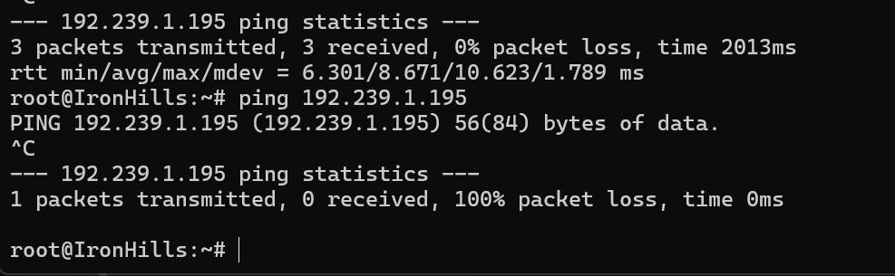


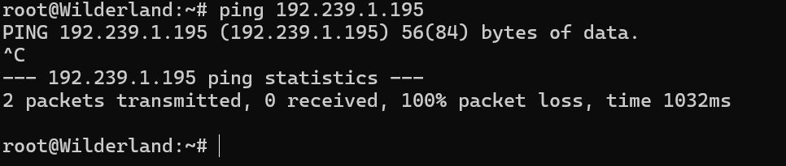

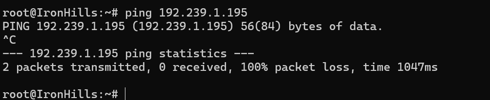


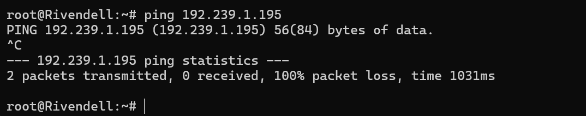


Terbukti bahwa client lain atau daerah lain tidak dapat melakukan ping pada node Vilya


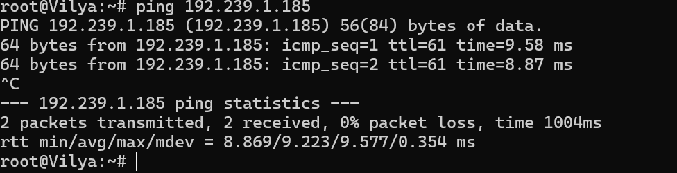

Uji ping dari VIlya ke Wilderland


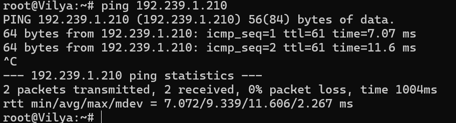

Uji ping dari Vilya ke IronHils


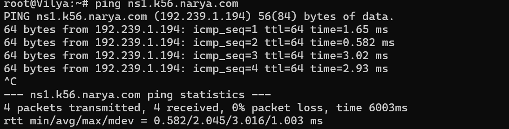


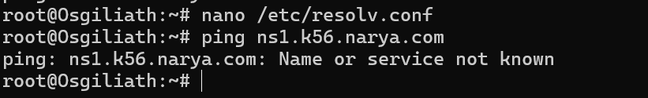

Selain Vilya tidak akan dapat ping ke Narya


### Narya


```
auto eth0
iface eth0 inet static
    address 192.239.1.194
    netmask 255.255.255.248
    gateway 192.239.1.193
    # DNS arahkan ke Google dulu untuk install paket
    dns-nameservers 192.168.122.1
up echo nameserver 192.168.122.1 > /etc/resolv.conf
```


Setup

```
apt update && apt install netcat-openbsd -y
apt install bind9 -y
ln -s /etc/init.d/named /etc/init.d/bind9

nano /etc/bind/named.conf.options

isi dengan berikut : 

options {
    directory "/var/cache/bind";

    # Tambahkan Forwarder ke Google (Opsional)
    forwarders {
        192.168.122.1
        8.8.8.8;
    };

    dnssec-validation no;
    listen-on-v6 { any; };
    allow-query { any; };   
};


Untuk dapat resolve ns1.k56.narya.com maka butuh edit pada named.conf.local 

nano /etc/bind/named.conf.local

zone "ns1.k56.narya.com" {
    type master;
    file "/etc/bind/db.k56";
};

Setelah itu 

nano /etc/bind/db.k56

;
; BIND data file for k56.narya.com
;
$TTL    604800
@       IN      SOA     ns1.k56.narya.com. root.k56.narya.com. (
                              2         ; Serial
                         604800         ; Refresh
                          86400         ; Retry
                        2419200         ; Expire
                         604800 )       ; Negative Cache TTL
;
; --- DAFTAR NAME SERVER (NS) ---
@       IN      NS      ns1.k56.narya.com.

; --- DAFTAR ALAMAT IP (A RECORDS) ---
@       IN      A       192.239.1.194       ; Domain utama @ -> IP Narya
ns1     IN      A       192.239.1.194       ; ns1 -> IP Narya
vilya   IN      A       192.239.1.195       ; vilya -> IP Vilya
palantir IN     A       192.239.1.202       ; Web Server Palantir (Contoh)
```


Firewall script 

```
# 1. Izinkan Vilya (192.239.1.195) mengakses port 53 (TCP & UDP)
iptables -A INPUT -p tcp --dport 53 -s 192.239.1.195 -j ACCEPT
iptables -A INPUT -p udp --dport 53 -s 192.239.1.195 -j ACCEPT

# 2. Blokir SEMUA akses lain ke port 53
iptables -A INPUT -p tcp --dport 53 -j DROP
iptables -A INPUT -p udp --dport 53 -j DROP
```


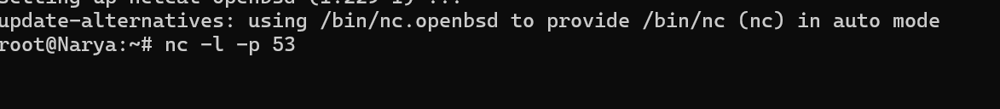

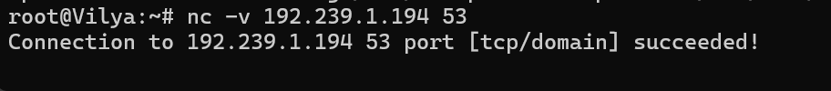

Berhasil,Vilya dapat melakukan netcat atau nc pada node Narya

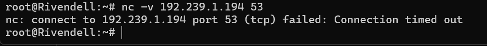

Sedangkan Rivendell akan timeout


***


### Minastir


Konfigurasinya

```
auto lo
iface lo inet loopback

# --- UPLINK (Ke Osgiliath) ---
auto eth0
iface eth0 inet static
    address 192.239.1.226
    netmask 255.255.255.252
    gateway 192.239.1.225

# --- DOWNLINK (LAN Elendil & Isildur) ---
auto eth1
iface eth1 inet static
    address 192.239.0.1
    netmask 255.255.255.0

# --- LINK KE PELARGIR ---
auto eth2
iface eth2 inet static
    address 192.239.1.233
    netmask 255.255.255.252

# --- ROUTING TAMBAHAN ---
# Minastir harus tahu cara ke Palantir (.200) & Anduin (.0)
# Semua dilempar ke Pelargir (.234)
up ip route add 192.239.1.200/29 via 192.239.1.234
up ip route add 192.239.1.0/25 via 192.239.1.234

# 1. Rute ke LAN Anduin/Gilgalad (192.239.1.0/25)
# "Kalau ada paket buat Pasukan Gilgalad, lempar ke Pelargir (.234)"
ip route add 192.239.1.0/25 via 192.239.1.234

# 2. Rute ke Link Pelargir-Anduin (192.239.1.236/30)
# "Kalau ada paket buat Router Anduin, lempar ke Pelargir (.234)"
ip route add 192.239.1.236/30 via 192.239.1.234

```


Setup DHCP Relay 

```
apt update
apt install isc-dhcp-relay -y
nano /etc/default/isc-dhcp-relay

# /etc/default/isc-dhcp-relay

SERVERS="192.239.1.195"
INTERFACES="eth0 eth1 eth2"
OPTIONS=""
```


***


### Pelargir

```
auto lo
iface lo inet loopback

# --- ARAH MINASTIR ---
auto eth0
iface eth0 inet static
    address 192.239.1.234
    netmask 255.255.255.252
    gateway 192.239.1.233

# --- LAN PALANTIR ---
auto eth1
iface eth1 inet static
    address 192.239.1.201
    netmask 255.255.255.248   # /29

# --- ARAH ANDUIN ---
auto eth2
iface eth2 inet static
    address 192.239.1.237
    netmask 255.255.255.252

# --- ROUTING TAMBAHAN ---
# Pelargir harus tahu cara ke Pasukan Gilgalad (Anduin LAN)
# Dilempar ke AnduinBanks (.238)
up ip route add 192.239.1.0/25 via 192.239.1.238
```


***


### Palantir (Web server)


```
auto eth0
iface eth0 inet static
    address 192.239.1.202
    netmask 255.255.255.248
    gateway 192.239.1.201    # IP Pelargir eth1
up echo nameserver 192.168.122.1 > /etc/resolv.conf
    dns-nameservers 192.239.1.194  # IP Narya
```


Setup firewall

```
iptables -F

# 1. Aturan Faksi ELF (Gilgalad/Cirdan)
iptables -A INPUT -p tcp --dport 80 -s 192.239.1.0/25 -m time --timestart 07:00 --timestop 15:00 -j ACCEPT

# 2. Aturan Faksi MANUSIA (Elendil/Isildur)
iptables -A INPUT -p tcp --dport 80 -s 192.239.0.0/24 -m time --timestart 17:00 --timestop 23:00 -j ACCEPT

# 3. Blokir sisa akses ke Web
iptables -A INPUT -p tcp --dport 80 -j DROP

Untuk troubleshooting

# 1. Pastikan IP tidak hilang setelah restart
ip addr show
# (Wajib ada inet 192.239.1.202)

# 2. Pastikan tidak ada firewall sisa
iptables -F
iptables -X
```

Setup script anti deteksi nmap

```
# 1. Buat Chain Baru untuk Log (Opsional, biar rapi)
iptables -N LOG_DROP

# 2. Cek apakah IP sudah di-Blacklist (PORT_SCAN_DETECTED)? Kalau iya, DROP SEMUA (Ping/NC/Curl mati)
iptables -A INPUT -m recent --name PORT_SCAN_DETECTED --rcheck --seconds 60 -j DROP

# 3. Hitung koneksi baru (SYN packet)
iptables -A INPUT -p tcp --syn -m recent --name CHECK_PORTS --set

# 4. Jika IP yang sama mengetuk > 15 kali dalam 20 detik -> Masuk LOG_DROP
iptables -A INPUT -p tcp --syn -m recent --name CHECK_PORTS --rcheck --seconds 20 --hitcount 15 -j LOG_DROP

# --- KONFIGURASI CHAIN LOG_DROP ---
# Catat Log
iptables -A LOG_DROP -j LOG --log-prefix "PORT_SCAN_DETECTED: " --log-level 4
# Masukkan IP ke Blacklist (PORT_SCAN_DETECTED)
iptables -A LOG_DROP -m recent --name PORT_SCAN_DETECTED --set
# Drop paketnya
iptables -A LOG_DROP -j DROP
```


***


### Elendil,Isildur,Cirdan, dan Gilgalad

```
auto eth0
iface eth0 inet dhcp

up echo nameserver 192.168.122.1 > /etc/resolv.conf
```


***

### Others (Pengujian)


```
apt install apache2-utils
# Tembak 100 request, dengan 10 koneksi bersamaan (Concurrency 10)
ab -n 100 -c 10 http://192.239.1.210/
```


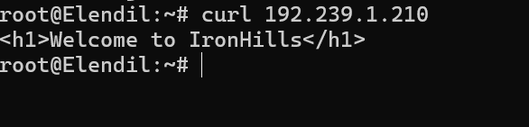

Uji IronHills dari client lain


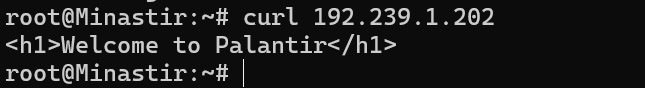

Uji curl Palantir dari node Minastir


